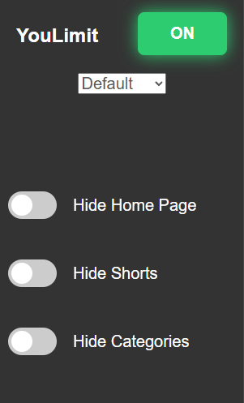
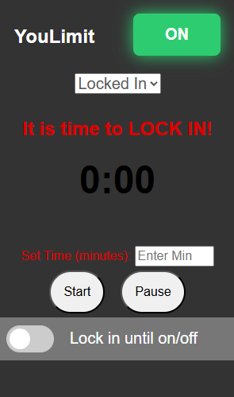

# YouLimit !

### YouLimit is the chrome extension you need to finally LOCK IN while learning or studying online. It has several features that hide distracting aspects of the YouTube website to help you stay focused !

## Default Mode

  
In default mode, users have control over how much of youtube's elements get hidden.

### Hide Home Toggle

Enabling this toggle will completely hide all content on the recommended page.

### Hide Shorts

Enabling this toggle will completely most shorts content on home page and while searching.

### Hide Categories

Enabling this toggle will filter out videos that do belong to the 'Educational' or 'Science  
and Technology' categories.  
note: _Youtube API key required, current has key exists on locally on client side ignored by git_

## Locked In Mode

  
In 'Locked In' mode, offers more simplicity as well as the option for more accountability while  
studying.

### Lock In Toggle

By using the 'Lock In' toggle, users can quickly apply all focus features at once.  
The user can then turn the toggle off whenever they wish.

### Lock In Timer

By using the the timer to choose how many minutes to focus for, all focus features will be applied unless 1 of 2 conditions are met:

1. If the timer runs out, 'Locked In' mode will turn off.
   <video src="assets/timer.mp4" width="600" controls>
   Your browser does not support the video tag.
   </video>
2. If the user wants to exit 'Locked In' mode early, they  
    must complete a math problem.
   <video src="assets/endEarly.mp4" width="600" controls>
   Your browser does not support the video tag.
   </video>
